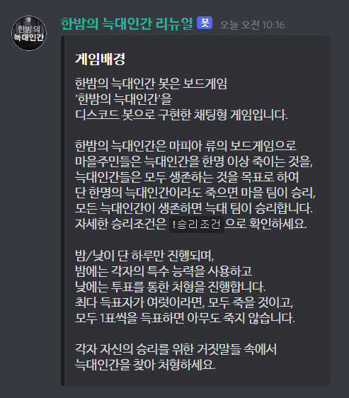

<!-- PROJECT LOGO -->
<br />
<p align="center">
  <h1 style="font-size:30pt" align="center">한밤의 늑대인간 디스코드 봇</h1>
  <p align="center">
    한밤의 늑대인간을 친구들과 온라인으로 즐기세요!<br><br>
  <a href="https://github.com/goyohangoyoill/ONUWF">
    
  </a>
  </p>
</p>

<br><br>
<!-- TABLE OF CONTENTS -->
<details open="open">
  <summary><b>Table of Contents</b></summary>
  <ol>
    <li>
      <a href="#사용-방법">사용 방법</a>
      <ul>
        <li><a href="#초대-방법">디스코드 봇 초대</a></li>
        <li><a href="#사용-방법">사용 방법</a></li>
      </ul>
    </li>
    <li>
      <a href="#도움말">도움말</a>
      <ul>
        <li><a href="#명령어">한밤의 늑대인간 봇 명령어</a></li>
        <li><a href="#도움말">도움말</a></li>
        <li><a href="#승리조건">각 진영 승리조건</a></li>
        <li><a href="#직업소개">각 직업 및 특수능력 소개</a></li>
      </ul>
    </li>
  </ol>
</details>

<!-- GETTING STARTED --->
## **사용 방법**

한밤의 늑대인간 디스코드 봇을 활용하는 방법

### **초대 방법**

디스코드 봇을 사용하기 위해서는 관리자 권한이 있는 디스코드 서버가 존재해야 합니다.<br>
서버 운영자에게 관리자 권한을 받거나 새로운 서버를 개설한 후<br>
다음 링크에 접속하여 원하는 서버에 한밤의 늑대인간 봇을 추가하세요.<br>

*디스코드 초대 링크는 아직 공개하지 않았습니다.*

### **사용 방법**

1. `!시작` 을 전송하여 게임을 시작합니다.
2. 원하는 직업의 번호 버튼을 눌러 직업을 설정합니다.
3. 참가하려는 디스코드 참여자들은 ⭕ 버튼을 눌러 참가합니다.
4. 직업 수와 인원 수가 맞는다면 ▶️ 버튼을 눌러 게임을 시작합니다.
5. 개인별 DM으로 전송된 각 직업들의 특수 능력을 사용합니다.
6. 자유로운 토론을 통해 처형할 플레이어를 투표합니다.
7. 가장 많은 표를 얻은 플레이어들을 처형합니다. 동률인 경우 여러 명이 처형됩니다.
8. 각자의 직업과 특수능력 사용 로그를 보여주고 게임을 종료합니다.

<br><br><br>

## **도움말**

한밤의 늑대인간 플레이를 위한 도움말

### **명령어**

> 디스코드에서 `'!'` 로 시작하는 메시지 중<br>
> 명령어로 등록되어 있는 메시지에 반응하여 게임이 진행됩니다.<br>
> 명령어 목록은 다음과 같습니다.

+ 참고 명령어
  - `!명령어` : 사용할 수 있는 모든 명령어 불러오기
  - `!도움말` : '한밤의 늑대인간'봇의 도움말 불러오기
  - `!게임배경` : 간단한 게임 배경 설명 불러오기
  - `!게임방법` : 게임진행을 위한 간단한 설명 불러오기
  - `!참고` : 참고할만한 메시지 불러오기

+ 게임 진행 명령어
  - `!시작` : 게임을 시작하기 위한 명령어
  - `!강제종료` : 진행중인 게임 종료를 위한 명령어

+ 게임 룰 관련 명령어
  - `!직업목록` : 구현된 직업의 목록 불러오기
  - `!직업소개 <직업명>` : 각 직업의 간단한 소개 불러오기
  - `!직업소개 모두` : 구현된 모든 직업의 간단한 소개 불러오기
  (스압 방지를 위해 DM으로 전송됨)
  - `!능력순서` : 특수 능력 사용 순서 불러오기
  - `!승리조건` : 각 진영의 자세한 승리 조건 불러오기

+ 개인 데이터 명령어
  - `!내정보` : 게임관련 프로필을 DM으로 받는 명령어
  - `!닉네임` : 게임에 참여할 때 사용할 닉네임을 변경하는 명령어

### **도움말**

> 한밤의 늑대인간 봇은 보드게임<br>
> '한밤의 늑대인간'을<br>
> 디스코드 봇으로 구현한 채팅형 게임입니다.<br>
> <br>
> 한밤의 늑대인간은 마피아 류의 보드게임으로<br>
> 마을주민들은 늑대인간을 한명 이상 죽이는 것을,<br>
> 늑대인간들은 모두 생존하는 것을 목표로 하여<br>
> 단 한명의 늑대인간이라도 죽으면 마을 팀이 승리,<br>
> 모든 늑대인간이 생존하면 늑대 팀이 승리합니다.<br>
> 자세한 승리조건은 `승리조건` 으로 확인하세요.<br>
> <br>
> 밤/낮이 단 하루만 진행되며,<br>
> 밤에는 각자의 특수 능력을 사용하고<br>
> 낮에는 투표를 통한 처형을 진행합니다.<br>
> 최다 득표자가 여럿이라면, 모두 죽을 것이고,<br>
> 모두 1표씩을 득표하면 아무도 죽지 않습니다.<br>
> <br>
> 각자 자신의 승리를 위한 거짓말들 속에서<br>
> 늑대인간을 찾아 처형하세요.<br>

### **승리조건**

+ 마을주민팀 승리조건
 1. 늑대인간이 존재하는 경우
     - 늑대인간이 하나 이상 죽어야 한다.
 2. 늑대인간이 존재하지 않는 경우
     - (서로 1표씩 투표해서) 아무도 죽지 않아야 한다.
     무두장이의 사망 여부는 마을 팀의 승리 여부와 무관하다.

+ 늑대인간팀 승리조건
 1. 늑대인간이 존재하는 경우
     - 늑대인간 중 누구도 죽지 않는다.
 2. 늑대인간 없이 하수인만 존재하는 경우
     - 누군가는 죽어야 하며 하수인은 살아있어야 한다.
     - 무두장이가 존재하는 경우, 무두장이는 살아있어야 한다.

+ 무두장이팀 승리조건
   - 무두장이는 자신이 죽으면 승리한다.

**※모든 진영이 패배하는 케이스도 있습니다.**

### **직업소개**

> 게임 시작 전에 설정한 직업 세트 중 3장을 랜덤으로 제거하고,<br>
> 각 플레이어들에게 자신에게 배정된 직업을 DM으로 전송합니다.<br>
> 다음은 한밤의 늑대인간 각 직영의 직업 및 해당 직업의 특수 능력 입니다.<br>

+ *늑대인간 진영*
  * **늑대인간**<br>
당신의 차례에 동료 늑대인간을 확인할 수 있습니다.<br>
만약 동료 늑대인간이 없다면<br>
버려진 직업 3개 중 1개를 확인할 수 있습니다.<br>
하수인이 있다면 당신을 몰래 도와줄 수도 있어요.<br>
마을 사람들을 혼란에 빠뜨리고 살아남으세요.<br>
  * **하수인**<br>
잠시후 당신은 누가 늑대인간인지 알게 됩니다.<br>
하지만 늑대인간들은 누가 하수인인지 모르죠.<br>
늑대인간이 있는 경우 모든 늑대인간이 살아남도록<br>
도우세요. 하수인이 죽어도 늑대인간팀이 승리합니다.<br>
만약 늑대인간이 없다면 마을주민팀에서 사망자가<br>
나오도록 만드셔야 승리할 수 있습니다.<br>

+ *마을주민 진영*
  * **마을주민**<br>
당신은 아무런 능력도 가지지 못했습니다.<br>
불안과 공포속에서 늑대인간을 찾아 처형하세요.<br>
  * **수호자**<br>
당신은 빛의 힘이 깃든 방패를 들었습니다<br>
당신이 고른 한 사람은 방패의 힘으로<br>
누구도 능력의 대상으로 선택할 수 없도록 만듭니다.<br>
그 사람이 늑대인간이라고 할지라도..<br>
  * **도플갱어**<br>
처음으로 만난 사람의 직업을 복제합니다.<br>
복제한 능력을 사용할 수 있습니다.<br>
당신은 복제한 사람 편에 섭니다.<br>
  * **프리메이슨**<br>
당신은 동료 프리메이슨을 확인합니다.<br>
만약 프리메이슨이 버려졌다면<br>
다른 프리메이슨이 없음을 확인합니다.<br>
동료와 함께 늑대인간을 처형하세요.<br>
  * **예언자**<br>
당신은 버려진 3개의 직업들 중 2개를 보거나<br>
다른 사람 하나의 직업을 볼 수 있습니다.<br>
예언이 밝혀준 곳을 따라 늑대인간을 찾아 처형하세요.<br>
  * **강도**<br>
당신은 누군가의 직업을 훔칠 수 있습니다.<br>
능력을 도둑맞은 사람은 강도가 되고<br>
자신이 아직 원래 직업인 줄 알 겁니다.<br>
훔친 능력에 맞게 누군가를 처형하세요.<br>
  * **말썽쟁이**<br>
당신의 차례에 두 사람을 고릅니다.<br>
그 두 사람의 직업을 맞바꿉니다.<br>
말썽쟁이는 두 사람의 직업을 확인하지는 못합니다.<br>
혼란스럽겠지만 늑대인간을 찾아 처형하세요<br>
  * **주정뱅이**<br>
당신은 술에 잔뜩 취해 직업을 하나 주웠습니다.<br>
그치만 그 직업이 어떤 직업인지 기억이 안 나요...<br>
어쩌면 당신은 늑대인간일지도..?<br>
  * **불면증환자**<br>
당신은 잠이 든 지 얼마 지나지 않아 깨어났습니다.<br>
덕분에 당신은 당신이 무엇인지 알 수 있었죠.<br>
늑대인간을 찾아 처형하세요..<br>
당신이 늑대인간이 되지 않았다면요.<br>
  * **사냥꾼**<br>
당신은 노련한 사냥꾼입니다.<br>
당신이 늑대인간이라고 생각하는 한 사람에게 투표하세요.<br>
당신이 처형된다면 길동무로 데려갈 수 있습니다.<br>

+ *무두장이 진영*
  * **무두장이**<br>
당신은 죽기로 결심했죠.<br>
당신이 늑대인간인 것처럼 연기하세요.<br>
처형된다면 당신의 승리입니다.<br>

## 개발 관련

한밤의 늑대인간 디스코드 봇 개발 관련 정보

### 설치해야하는 라이브러리

- mongoDB
```
go get go.mongodb.org/mongo-driver/mongo
```

- discordgo
```
go get github.com/bwmarrin/discordgo
```

- discordgo embed
```
go get github.com/clinet/discordgo-embed
```

### 설계 진행 상황

https://draw.io 접속 후 struct_diagram.drawio 선택하여 편집/확인 가능

https://gitmind.com/app/doc/1362405404 -> 이전 설계
